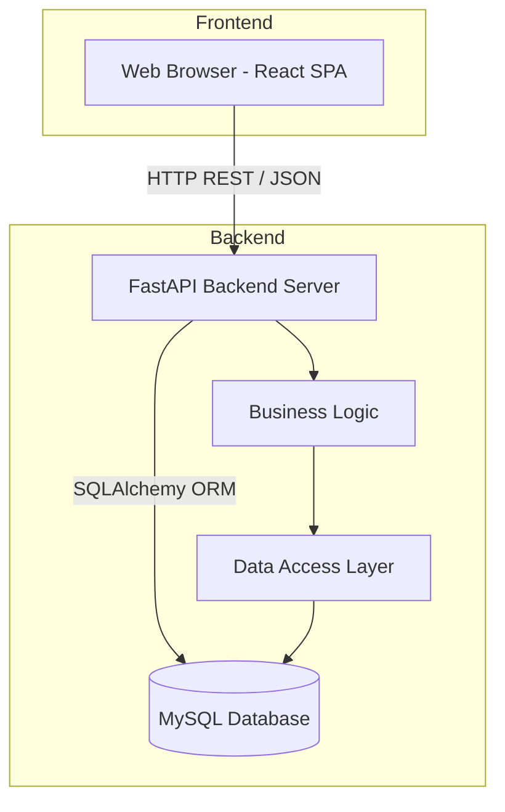

# Global System Architecture

## 1. System Overview
**Creative Studio Management System (CSMS)** is a comprehensive internal web application designed specifically for the Creative Division to manage production workflows, inventory assets, product movements, reporting, and employee activities.

The system adopts a modern **Client-Server Architecture**, separating the frontend presentation layer from the backend business logic and data access layers.

## 2. High-Level Architecture Diagram
The architecture follows a standard 3-tier model:

## 3. Technology Stack

### **Frontend**
- **Core:** React 19, Vite, JavaScript (ES6+)
- **Styling:** TailwindCSS 4, PostCSS, Autoprefixer
- **State & Data Fetching:** React Context API, React Query (@tanstack/react-query), Axios
- **Form Management:** React Hook Form
- **Routing:** React Router DOM
- **UI Icons:** Lucide React
- **Data Visualization:** Recharts

### **Backend**
- **Core:** Python 3, FastAPI, Uvicorn (ASGI)
- **Database & ORM:** MySQL, SQLAlchemy, PyMySQL
- **Database Migrations:** Alembic
- **Data Validation:** Pydantic
- **Security & Authentication:** Passlib (Bcrypt), Python-JOSE (JWT)
- **File Parsing & Generation:** Openpyxl (Excel), FPDF2 (PDF), Python-Multipart

### **Database**
- MySQL Relational Database.

## 4. Security & Access Control
- **Authentication:** Token-based using JWT (JSON Web Tokens). Tokens are issued upon login and sent via HTTP `Authorization` headers (Bearer).
- **Authorization:** Permission-Based Access Control (PBAC). The backend enforces route-level and action-level authorization based on the user's role and associated permissions.
- **Data Security:** Passwords are mathematically hashed using `bcrypt` before database insertion.

## 5. Deployment Topology (Recommended)
While the repository is optimized for local development via standard Python/Node environments, a typical production deployment for this stack would involve:
- **Frontend Hosting:** Static file serving (e.g., Nginx, Vercel, Netlify) serving the `dist/` bundle generated by `npm run build`.
- **Backend Hosting:** A WSGI/ASGI application server (e.g., Gunicorn with Uvicorn workers) running the FastAPI application, reverse-proxied by Nginx.
- **Database:** A managed MySQL instance.

## 6. Core Modules (Business Domains)
- **User Management & PBAC:** Authentication, users, roles, and granular permissions.
- **Inventory Management:** Categories, locations, physical assets, borrowing/returning flows, and transaction logs.
- **Product Management:** Product catalog (master data), stock overview, and product movement histories.
- **Work Management:** Tracking daily activities of creative staff, status transitions (Start, Pause, Resume, Complete), and time duration tracking.
- **Reporting & Analytics:** Real-time dashboard KPI aggregations and scheduled reporting generation (PDF, Excel).
