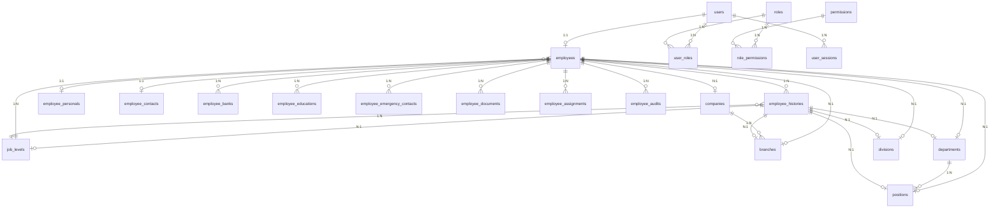

# Employee & User Architecture

## Daftar Isi

- [1. Filosofi Arsitektur](#1-filosofi-arsitektur)
- [2. Perbandingan Entitas](#2-perbandingan-entitas)
- [3. Entity Relationship Diagram](#3-entity-relationship-diagram)
- [4. User Model](#4-user-model)
- [5. JobLevel — Master Data Baru](#5-joblevel--master-data-baru)
- [6. Employee Model](#6-employee-model)
  - [6.1 Tabel `employees`](#61-tabel-employees)
  - [6.2 Enum: `EmploymentStatus`](#62-enum-employmentstatus)
  - [6.3 Enum: `EmploymentType`](#63-enum-employmenttype)
  - [6.4 Relasi](#64-relasi)
  - [6.5 Soft Delete](#65-soft-delete)
- [7. Employee Personal](#7-employee-personal)
- [8. Employee History](#8-employee-history)
- [9. Employee Assignment](#9-employee-assignment)
- [10. Employee Contact](#10-employee-contact)
- [11. Employee Education](#11-employee-education)
- [12. Employee Bank](#12-employee-bank)
- [13. Employee Emergency Contact](#13-employee-emergency-contact)
- [14. Employee Document](#14-employee-document)
- [15. Employee Audit Trail](#15-employee-audit-trail)
- [16. Employee Number Generator](#16-employee-number-generator)
- [17. Validasi Department-Position](#17-validasi-department-position)
- [18. Struktur Kode](#18-struktur-kode)
- [19. API Endpoints](#19-api-endpoints)
- [20. Flow HR: Rekrutmen hingga Login](#20-flow-hr-rekrutmen-hingga-login)
- [21. Integrasi dengan Modul Lain](#21-integrasi-dengan-modul-lain)
- [22. Permission & Authorization](#22-permission--authorization)
- [23. Panduan Migrasi](#23-panduan-migrasi)
- [24. Best Practices](#24-best-practices)

---

## 1. Filosofi Arsitektur

Arsitektur Employee & User didasarkan pada prinsip **pemisahan tanggung jawab** (Separation of Concerns):

| Layer | Tanggung Jawab | Contoh Data |
|-------|---------------|-------------|
| **User** (Authentication) | Login, session, keamanan | `username`, `email`, `password_hash`, JWT |
| **Employee** (Identity) | Identitas perusahaan, struktur organisasi | `employee_number`, `full_name`, `branch`, `department`, `position`, `job_level` |
| **Employee sub-models** (HR Detail) | Data HR personal terpisah | Personal, Contact, Education, Bank, Emergency Contact, Document |

**Mengapa dipisah?**

1. **Pada implementasi Wadimor V1**, setiap Employee diwajibkan memiliki User (relasi 1:1). Arsitektur tetap memungkinkan kebijakan ini diubah pada versi mendatang apabila perusahaan memerlukan karyawan tanpa akun sistem atau *service account*.
2. **User untuk login, Employee untuk bisnis** — Modul Leave, Payroll, Attendance, Clinic, Performance, Recruitment semuanya butuh `employee_id`, bukan `user_id`.
3. **Skalabilitas jangka panjang** — Struktur ini memungkinkan pengembangan modul ERP ke depan tanpa mengubah fondasi autentikasi.

```
┌─────────────────────────────────────────────────────┐
│                     users                            │
│  (Authentication Only)                              │
│  id, username, email, password, is_active,           │
│  is_verified, must_change_password, last_login        │
└────────────────────┬────────────────────────────────┘
                     │ 1:1
┌────────────────────▼────────────────────────────────┐
│                   employees                           │
│  (Business Identity + Org Structure + JobLevel)      │
│  id, employee_number, full_name, company_id,         │
│  branch_id, department_id, position_id, division_id, │
│  job_level_id, employment_status, employment_type,   │
│  join_date, deleted_at, deleted_by, delete_reason     │
└───────┬──────────┬──────────┬──────────┬─────┬──────┘
        │          │          │          │     │
   1:1  │    1:N   │   1:N    │   1:N    │ 1:N │  1:N
   ┌────▼──┐  ┌───▼────┐ ┌───▼────┐ ┌──▼────┐ ┌──▼──────┐
   │Contact│  │  Bank  │ │Education│ │Emergen│ │Document │
   │(1 tbl)│  │(multiple)│(N rows) │ │Contact│ │(N rows) │
   │addr   │  │priority│ │cert#   │ │(multi)│ │expiry   │
   │split  │  │payroll │ │graduated│ │primary│ │doc#     │
   └───────┘  └────────┘ └────────┘ └───────┘ └─────────┘

┌───────────────────┐  ┌───────────────────┐  ┌──────────────────────┐
│ EmployeeHistory   │  │ EmployeeAssignment│  │  EmployeeAudit       │
│ (mutation log)    │  │ (temporary move)  │  │ (field tracking)     │
│ +salary_grade     │  │ +status           │  │ +ip_address          │
│ +job_level_id     │  │ (pending/approved)│  │ +user_agent          │
└───────────────────┘  └───────────────────┘  └──────────────────────┘

┌──────────────────────┐  ┌─────────────────────────┐
│   EmployeePersonal   │  │      JobLevel            │
│   (identity data)    │  │   (master data)          │
│   NIK, gender, DOB,  │  │   name, code, level      │
│   religion, BPJS,    │  │   (scoring, approvals)   │
│   blood_type, photo  │  │                          │
└──────────────────────┘  └─────────────────────────┘
```

---

## 2. Perbandingan Entitas

| Aspek | User | Employee | Sub-models (Personal, Contact, Bank, dll) |
|-------|------|----------|-------------------------------|
| **Primary Key** | `id` | `id` | `id` |
| **Relasi ke User** | — | `user_id` (FK, unique) | via Employee |
| **Relasi ke Employee** | `employee` (backref) | — | `employee_id` (FK) |
| **Tujuan** | Autentikasi & otorisasi | Identitas perusahaan & org chart + job level | Data HR personal per domain |
| **Dibuat oleh** | Registrasi / System | HR / Admin | HR / Admin |
| **Wajib untuk login?** | Ya | Ya (1:1) | Tidak (opsional) |
| **Direferensikan oleh** | Auth, Permission | **Semua modul ERP** | Hanya modul HR terkait |
| **Soft delete?** | Tidak | Ya (`deleted_at`, `deleted_by`, `delete_reason`) | Cascade dari Employee |
| **Audit trail?** | Tidak | Terpisah (`employee_audits`) | Terpisah (`employee_audits`) |

---

## 3. Entity Relationship Diagram



---

## 4. User Model

**Lokasi:** `app/models/user.py`

Tabel `users` menyimpan data autentikasi murni — tidak ada data HR atau bisnis di sini.

```sql
CREATE TABLE users (
    id                   INT PRIMARY KEY AUTO_INCREMENT,
    username             VARCHAR(50) NOT NULL UNIQUE,
    email                VARCHAR(100) NOT NULL UNIQUE,
    hashed_password      VARCHAR(255) NOT NULL,
    is_active            BOOLEAN DEFAULT TRUE,
    is_verified          BOOLEAN DEFAULT FALSE,
    must_change_password BOOLEAN DEFAULT TRUE,
    password_changed_at  DATETIME NULL,
    last_login           DATETIME NULL,
    created_at           DATETIME,
    updated_at           DATETIME,
    PRIMARY KEY (id)
) ENGINE=InnoDB DEFAULT CHARSET=utf8mb4;
```

**Deskripsi kolom:**

| Kolom | Tipe | Keterangan |
|-------|------|-----------|
| `id` | INT PK | Auto-increment |
| `username` | VARCHAR(50) UNIQUE | Nama pengguna untuk login |
| `email` | VARCHAR(100) UNIQUE | Email perusahaan |
| `hashed_password` | VARCHAR(255) | Hash bcrypt |
| `is_active` | BOOLEAN | Nonaktifkan akun (disable) |
| `is_verified` | BOOLEAN | Status verifikasi email/akun |
| `must_change_password` | BOOLEAN | **Wajib ganti password** saat login pertama (default: `TRUE`) |
| `password_changed_at` | DATETIME | Waktu terakhir ganti password |
| `last_login` | DATETIME | Waktu login terakhir |
| `created_at` | DATETIME | Waktu dibuat |
| `updated_at` | DATETIME | Waktu diupdate |

**Backward Compatibility: `full_name` Property**

```python
class User(Base):
    @property
    def full_name(self):
        if self.employee:
            return self.employee.full_name
        return self.username
```

**Cara akses:**

| Cara | Status | Keterangan |
|------|--------|-----------|
| `user.full_name` | ✅ **Boleh** | Property → membaca `employee.full_name` |
| `User.full_name.ilike(...)` | ❌ **Tidak boleh** | Bukan kolom SQL — gunakan `Employee.full_name` dengan JOIN |

---

## 5. JobLevel — Master Data Baru

**Lokasi:** `app/core/organization/job_level/models.py`

JobLevel adalah entitas master data yang berada satu level setelah Position dalam hierarki organisasi. Tujuannya adalah untuk memisahkan konsep **jabatan struktural** (Position: "Senior Designer", "Marketing Manager") dari **tingkatan/level** (JobLevel: "Staff", "Supervisor", "Manager", "Director") yang digunakan untuk aturan Payroll, Approval, dan Performance.

### 5.1 Mengapa JobLevel Dipisah dari Position?

| Aspek | Position | JobLevel |
|-------|----------|----------|
| **Fokus** | Tanggung jawab struktural | Skala/tingkatan jenjang karir |
| **Contoh** | "Senior UI Designer", "Brand Manager" | "Staff", "Supervisor", "Manager", "Director" |
| **Gaji** | Bisa berbeda per posisi | **Basis skala gaji** (salary grade) |
| **Approval Limit** | — | Manager dapat approve hingga 5jt, Director hingga 50jt |
| **Performance Target** | Per posisi | Per level (semakin tinggi, semakin besar ekspektasi) |
| **Jenjang Karir** | Mutasi horizontal antar posisi | Promosi ke level lebih tinggi |

### 5.2 Tabel `job_levels`

```sql
CREATE TABLE job_levels (
    id          INT PRIMARY KEY AUTO_INCREMENT,
    name        VARCHAR(100) NOT NULL,
    code        VARCHAR(50) NOT NULL UNIQUE,
    level       INT NOT NULL,
    description VARCHAR(255) NULL,
    is_active   BOOLEAN DEFAULT TRUE,
    created_at  DATETIME,
    updated_at  DATETIME
) ENGINE=InnoDB DEFAULT CHARSET=utf8mb4;
```

**Deskripsi kolom:**

| Kolom | Tipe | Keterangan |
|-------|------|-----------|
| `id` | INT PK | Auto-increment |
| `name` | VARCHAR(100) | Nama level (contoh: "Staff", "Supervisor", "Manager") |
| `code` | VARCHAR(50) UNIQUE | Kode unik untuk referensi sistem (contoh: "LVL-001") |
| `level` | INT | Urutan numerik — semakin tinggi, semakin senior |
| `description` | VARCHAR(255) | Deskripsi / tanggung jawab level |
| `is_active` | BOOLEAN | Aktif atau tidak (default: `TRUE`) |
| `created_at` | DATETIME | Waktu dibuat |
| `updated_at` | DATETIME | Waktu diupdate |

### 5.3 Integrasi dengan Modul Lain

JobLevel digunakan oleh:

| Modul | Penggunaan |
|-------|-----------|
| **Payroll** | Menentukan salary grade, batas gaji per level |
| **Approval** | Menentukan limit approval (misal: Manager approve hingga 5jt) |
| **Performance** | Ekspektasi KPI berbeda per level |
| **Employee** | Setiap Employee memiliki `job_level_id` |
| **EmployeeHistory** | Mencatat perubahan job level pada mutasi/promosi |

### 5.4 Permissions

| Permission Code | Method | Endpoint |
|-----------------|--------|----------|
| `job_level.view` | GET | `/api/v1/job-levels`, `/api/v1/job-levels/{id}` |
| `job_level.create` | POST | `/api/v1/job-levels` |
| `job_level.update` | PUT | `/api/v1/job-levels/{id}` |
| `job_level.delete` | DELETE | `/api/v1/job-levels/{id}` |

---

## 6. Employee Model

**Lokasi:** `app/core/organization/employee/models.py`

Employee adalah **entitas bisnis utama**. Semua modul ERP (Leave, Payroll, Attendance, Clinic, Recruitment, Performance, Training, Finance) mereferensikan `employee_id`, **bukan** `user_id`.

### 6.1 Tabel `employees`

```sql
CREATE TABLE employees (
    id                INT PRIMARY KEY AUTO_INCREMENT,
    user_id           INT NOT NULL UNIQUE,
    employee_number   VARCHAR(50) NOT NULL UNIQUE,
    full_name         VARCHAR(100) NOT NULL,
    company_id        INT NULL,
    branch_id         INT NULL,
    department_id     INT NULL,
    position_id       INT NULL,
    division_id       INT NULL,
    job_level_id      INT NULL,
    employment_status ENUM('active','probation','contract','intern',
                           'leave','resigned','terminated','retired',
                           'suspended') NOT NULL DEFAULT 'active',
    employment_type   ENUM('permanent','contract','intern',
                           'outsource','probation') NOT NULL DEFAULT 'permanent',
    join_date         DATE NULL,
    delete_reason     TEXT NULL,
    created_at        DATETIME,
    updated_at        DATETIME,
    deleted_at        DATETIME NULL,
    deleted_by        INT NULL,
    FOREIGN KEY (user_id) REFERENCES users(id),
    FOREIGN KEY (company_id) REFERENCES companies(id),
    FOREIGN KEY (branch_id) REFERENCES branches(id),
    FOREIGN KEY (department_id) REFERENCES departments(id),
    FOREIGN KEY (position_id) REFERENCES positions(id),
    FOREIGN KEY (division_id) REFERENCES divisions(id),
    FOREIGN KEY (job_level_id) REFERENCES job_levels(id),
    FOREIGN KEY (deleted_by) REFERENCES users(id)
) ENGINE=InnoDB DEFAULT CHARSET=utf8mb4;
```

**Perubahan dari V2 ke V3:**

| Kolom | V2 | V3 | Keterangan |
|-------|----|----|-----------|
| `job_level_id` | ❌ | ✅ Baru | FK ke `job_levels.id` — menandai level/jenjang karyawan |
| `delete_reason` | ❌ | ✅ Baru | Alasan soft delete (resign, PHK, pensiun, dll) |

### 6.2 Enum: `EmploymentStatus`

| Value | Arti | Keterangan |
|-------|------|-----------|
| `active` | Aktif | Karyawan tetap aktif |
| `probation` | Percobaan | Masa probation |
| `contract` | Kontrak | Karyawan kontrak dengan durasi tertentu |
| `intern` | Magang | Peserta magang / internship |
| `leave` | Cuti Panjang | Cuti di luar tanggungan (unpaid leave, maternity leave) |
| `resigned` | Mengundurkan Diri | Resign sukarela |
| `terminated` | PHK | Pemutusan hubungan kerja oleh perusahaan |
| `retired` | Pensiun | Memasuki usia pensiun |
| `suspended` | Skorsing | Skorsing sementara menunggu investigasi |

### 6.3 Enum: `EmploymentType`

| Value | Arti | Keterangan |
|-------|------|-----------|
| `permanent` | Tetap | Karyawan tetap (organik) |
| `contract` | Kontrak | PKWT dengan durasi tertentu |
| `intern` | Magang | Belum terikat kontrak kerja formal |
| `outsource` | Alih Daya | Karyawan dari perusahaan penyedia jasa |
| `probation` | Percobaan | Masa percobaan sebelum diangkat tetap |

> **Penting:** `employment_status` dan `employment_type` adalah dua hal berbeda.
> Contoh: Seseorang bisa berstatus `active` dengan tipe `contract` (aktif, karyawan kontrak),
> atau berstatus `leave` dengan tipe `permanent` (cuti, tetap).

### 6.4 Relasi

```
Employee (1) ──── (1) User                          → user
Employee (N) ──── (1) Company                       → company
Employee (N) ──── (1) Branch                        → branch
Employee (N) ──── (1) Department                    → department
Employee (N) ──── (1) Position                      → position
Employee (N) ──── (1) Division                      → division
Employee (N) ──── (1) JobLevel                      → job_level

Employee (1) ──── (1) EmployeePersonal              → personal (cascade)
Employee (1) ──── (1) EmployeeContact               → contact (cascade)
Employee (1) ──── (N) EmployeeEducation             → educations (cascade)
Employee (1) ──── (N) EmployeeBank                  → banks (cascade)
Employee (1) ──── (N) EmployeeEmergencyContact      → emergency_contacts (cascade)
Employee (1) ──── (N) EmployeeDocument              → documents (cascade)
Employee (1) ──── (N) EmployeeHistory               → histories
Employee (1) ──── (N) EmployeeAssignment            → assignments
Employee (1) ──── (N) EmployeeAudit                 → audits
```

**Perubahan nama relasi dari V2:**

| Entity | V2 (nama relasi) | V3 (nama relasi) | Alasan |
|--------|-----------------|-----------------|--------|
| EmployeeBank | `bank` | `banks` | Sekarang 1:N → plural |
| EmployeeEmergencyContact | `emergency_contact` | `emergency_contacts` | Sekarang 1:N → plural |
| EmployeePersonal | — | `personal` | Baru |

### 6.5 Soft Delete

Employee tidak pernah di-*hard delete* dari database. Sebagai gantinya, dua/ tiga kolom berikut diisi:

```python
deleted_at   = Column(DateTime, nullable=True)   # waktu soft delete
deleted_by   = Column(Integer, ForeignKey("users.id"), nullable=True)  # pelaku
delete_reason = Column(Text, nullable=True)       # alasan (resign/PHK/pensiun)
```

**Aturan:**
- Semua query `get_all` / `search` otomatis memfilter `deleted_at IS NULL`
- `GET /{id}` mengembalikan 404 jika employee sudah di-soft-delete
- Admin dengan permission `employee.restore` dapat melakukan restore
- Admin dengan permission `employee.delete` dapat melakukan *hard delete* dengan parameter `?hard=true`
- Semua relasi anak (personal, contact, bank, education, dll) ikut terhapus secara kaskade
- `soft_delete()` di service layer menerima parameter opsional `reason` yang akan diisi ke kolom `delete_reason`

---

## 7. Employee Personal

**Lokasi:** `app/core/organization/employee_personal/models.py`

Entity baru di V3 yang menyimpan data identitas pribadi karyawan. Dipisah dari Employee utama agar model Employee tetap ramping dan fokus pada data organisasi. Data personal seperti NIK, gender, agama, golongan darah, dan BPJS sangat jarang berubah dan digunakan oleh modul spesifik seperti Clinic (membaca blood_type, age dari birth_date) dan Payroll (BPJS).

```sql
CREATE TABLE employee_personals (
    id                INT PRIMARY KEY AUTO_INCREMENT,
    employee_id       INT NOT NULL UNIQUE,
    nik               VARCHAR(20) NULL,
    kk                VARCHAR(30) NULL,
    gender            VARCHAR(10) NULL,
    birth_place       VARCHAR(100) NULL,
    birth_date        DATE NULL,
    religion          VARCHAR(50) NULL,
    marital_status    VARCHAR(20) NULL,
    nationality       VARCHAR(50) NULL,
    blood_type        VARCHAR(5) NULL,
    photo             VARCHAR(500) NULL,
    identity_number   VARCHAR(50) NULL,
    tax_number        VARCHAR(50) NULL,
    bpjs_number       VARCHAR(50) NULL,
    created_at        DATETIME,
    updated_at        DATETIME,
    FOREIGN KEY (employee_id) REFERENCES employees(id) ON DELETE CASCADE
) ENGINE=InnoDB DEFAULT CHARSET=utf8mb4;
```

**Deskripsi kolom:**

| Kolom | Tipe | Keterangan |
|-------|------|-----------|
| `id` | INT PK | Auto-increment |
| `employee_id` | INT UNIQUE | FK ke employees (1:1) |
| `nik` | VARCHAR(20) | Nomor Induk Kependudukan (KTP) |
| `kk` | VARCHAR(30) | Nomor Kartu Keluarga |
| `gender` | VARCHAR(10) | Jenis kelamin: `Laki-laki`, `Perempuan` |
| `birth_place` | VARCHAR(100) | Tempat lahir |
| `birth_date` | DATE | Tanggal lahir |
| `religion` | VARCHAR(50) | Agama |
| `marital_status` | VARCHAR(20) | Status perkawinan: `Belum Kawin`, `Kawin`, `Cerai` |
| `nationality` | VARCHAR(50) | Kewarganegaraan |
| `blood_type` | VARCHAR(5) | Golongan darah: `A`, `B`, `AB`, `O` |
| `photo` | VARCHAR(500) | Path file foto profil |
| `identity_number` | VARCHAR(50) | Nomor identitas lain (SIM, Passport) |
| `tax_number` | VARCHAR(50) | NPWP |
| `bpjs_number` | VARCHAR(50) | Nomor BPJS Ketenagakerjaan / Kesehatan |

**Penggunaan oleh modul lain:**

| Modul | Data yang digunakan |
|-------|-------------------|
| **Clinic** | `blood_type` (darurat transfusi), `birth_date` (usia pasien), `bpjs_number` (klaim BPJS) |
| **Payroll** | `tax_number` (PPh 21), `bpjs_number` (potongan BPJS) |
| **HR Report** | `gender`, `religion`, `marital_status` (demografi karyawan) |

---

## 8. Employee History

**Lokasi:** `app/core/organization/employee_history/models.py`

Mencatat setiap perubahan organisasi yang dialami employee. Sangat penting untuk **payroll** (rate berbeda per periode), **audit**, dan **HR analytics**.

```sql
CREATE TABLE employee_histories (
    id                INT PRIMARY KEY AUTO_INCREMENT,
    employee_id       INT NOT NULL,
    branch_id         INT NULL,
    department_id     INT NULL,
    position_id       INT NULL,
    division_id       INT NULL,
    job_level_id      INT NULL,
    employment_status VARCHAR(50) NULL,
    employment_type   VARCHAR(50) NULL,
    salary_grade      VARCHAR(50) NULL,
    effective_date    DATE NOT NULL,
    end_date          DATE NULL,
    reason            TEXT NULL,
    changed_by        INT NULL,
    created_at        DATETIME,
    FOREIGN KEY (employee_id) REFERENCES employees(id),
    FOREIGN KEY (job_level_id) REFERENCES job_levels(id)
) ENGINE=InnoDB DEFAULT CHARSET=utf8mb4;
```

**Perubahan dari V2 ke V3:**

| Kolom | V2 | V3 | Keterangan |
|-------|----|----|-----------|
| `job_level_id` | ❌ | ✅ Baru | Mencatat job level saat mutasi/promosi |
| `salary_grade` | ❌ | ✅ Baru | Grade gaji yang berlaku di periode tersebut |

**Contoh data:**

| employee_id | department_id | position_id | job_level_id | salary_grade | effective_date | end_date | reason |
|-------------|--------------|-------------|-------------|-------------|----------------|----------|--------|
| 1 | 2 (Creative) | 3 (Designer) | 1 (Staff) | SG-01 | 2024-01-15 | 2024-12-31 | Awal bergabung |
| 1 | 3 (Marketing) | 5 (Marcom) | 1 (Staff) | SG-01 | 2025-01-01 | 2025-12-31 | Mutasi departemen |
| 1 | 4 (IT) | 7 (Developer) | 2 (Senior) | SG-03 | 2026-01-01 | NULL | Promosi + job level upgrade |

**Penggunaan:** Setiap kali employee di-*update* department/position/branch/job_level, system harus otomatis menutup history sebelumnya (isi `end_date`) dan membuat record baru.

---

## 9. Employee Assignment

**Lokasi:** `app/core/organization/employee_assignment/models.py`

Menangani skenario *temporary assignment* atau *cross-organization loan* tanpa mengubah data Employee utama.

```sql
CREATE TABLE employee_assignments (
    id                  INT PRIMARY KEY AUTO_INCREMENT,
    employee_id         INT NOT NULL,
    target_branch_id    INT NULL,
    target_department_id INT NULL,
    target_position_id  INT NULL,
    assignment_type     VARCHAR(50) NOT NULL DEFAULT 'temporary',
    status              VARCHAR(20) NOT NULL DEFAULT 'pending',
    start_date          DATE NOT NULL,
    end_date            DATE NULL,
    reason              TEXT NULL,
    created_by          INT NULL,
    created_at          DATETIME,
    FOREIGN KEY (employee_id) REFERENCES employees(id)
) ENGINE=InnoDB DEFAULT CHARSET=utf8mb4;
```

**Perubahan dari V2 ke V3:**

| Kolom | V2 | V3 | Keterangan |
|-------|----|----|-----------|
| `status` | ❌ | ✅ Baru | Status persetujuan assignment |

**Status values:**

| Status | Arti | Keterangan |
|--------|------|-----------|
| `pending` | Menunggu | Assignment diajukan, belum disetujui |
| `approved` | Disetujui | Assignment aktif |
| `rejected` | Ditolak | Assignment ditolak oleh atasan |
| `completed` | Selesai | Assignment sudah berakhir |

**Skenario yang didukung:**

| assignment_type | Contoh |
|----------------|--------|
| `temporary` | Dipinjam ke cabang lain 3 bulan |
| `project` | Ditugaskan ke Project X |
| `replacement` | Mengganti karyawan yang cuti |
| `rotation` | Rotasi jabatan sementara |

> **Penting:** Assignment **tidak mengubah** data `branch_id` / `department_id` / `position_id` / `job_level_id` di tabel `employees`. Data assignment digunakan oleh module seperti Attendance untuk menentukan lokasi kerja aktual employee pada periode tertentu.

---

## 10. Employee Contact

**Lokasi:** `app/core/organization/employee_contact/models.py`

Menyimpan data kontak dan alamat karyawan. Di V3, alamat dipecah menjadi **alamat domisili** (current) dan **alamat KTP** (permanent) untuk mengakomodasi karyawan yang bertempat tinggal berbeda dengan alamat KTP.

```sql
CREATE TABLE employee_contacts (
    id                    INT PRIMARY KEY AUTO_INCREMENT,
    employee_id           INT NOT NULL UNIQUE,
    phone                 VARCHAR(50) NULL,
    alternate_phone       VARCHAR(50) NULL,
    current_address       TEXT NULL,
    current_province      VARCHAR(100) NULL,
    current_city          VARCHAR(100) NULL,
    current_district      VARCHAR(100) NULL,
    current_postal_code   VARCHAR(20) NULL,
    permanent_address     TEXT NULL,
    permanent_province    VARCHAR(100) NULL,
    permanent_city        VARCHAR(100) NULL,
    permanent_district    VARCHAR(100) NULL,
    permanent_postal_code VARCHAR(20) NULL,
    is_active             BOOLEAN DEFAULT TRUE,
    created_at            DATETIME,
    updated_at            DATETIME,
    FOREIGN KEY (employee_id) REFERENCES employees(id) ON DELETE CASCADE
) ENGINE=InnoDB DEFAULT CHARSET=utf8mb4;
```

**Perubahan dari V2 ke V3:**

| Kolom | V2 (lama) | V3 (baru) | Keterangan |
|-------|----------|-----------|-----------|
| `address` | ✅ | ❌ Dihapus | Diganti `current_address` + `permanent_address` |
| `province` | ✅ | ❌ Dihapus | Diganti `current_province` + `permanent_province` |
| `city` | ✅ | ❌ Dihapus | Diganti `current_city` + `permanent_city` |
| `district` | ✅ | ❌ Dihapus | Diganti `current_district` + `permanent_district` |
| `postal_code` | ✅ | ❌ Dihapus | Diganti `current_postal_code` + `permanent_postal_code` |
| `current_*` | ❌ | ✅ Baru | 5 kolom alamat domisili |
| `permanent_*` | ❌ | ✅ Baru | 5 kolom alamat KTP |

**Prefix kolom:**

| Prefix | Arti | Contoh |
|--------|------|--------|
| `current_` | Alamat domisili (tinggal sekarang) | `current_city = "Jakarta Selatan"` |
| `permanent_` | Alamat KTP (sesuai KTP) | `permanent_city = "Wonogiri"` |

Jika alamat domisili sama dengan KTP, cukup isi `permanent_*` dan biarkan `current_*` kosong — frontend dapat memberikan opsi "sama dengan KTP".

---

## 11. Employee Education

**Lokasi:** `app/core/organization/employee_education/models.py`

Satu employee bisa memiliki **banyak** record pendidikan. Record dengan `is_highest = TRUE` dianggap sebagai pendidikan terakhir.

```sql
CREATE TABLE employee_educations (
    id                 INT PRIMARY KEY AUTO_INCREMENT,
    employee_id        INT NOT NULL,
    level              VARCHAR(50) NOT NULL,    -- SD, SMP, SMA, D3, S1, S2, S3
    institution        VARCHAR(200) NOT NULL,
    major              VARCHAR(100) NULL,
    graduation_year    VARCHAR(4) NULL,
    gpa                VARCHAR(10) NULL,
    certificate_number VARCHAR(100) NULL,
    is_highest         BOOLEAN DEFAULT FALSE,
    graduated          BOOLEAN DEFAULT TRUE,
    created_at         DATETIME,
    FOREIGN KEY (employee_id) REFERENCES employees(id) ON DELETE CASCADE
) ENGINE=InnoDB DEFAULT CHARSET=utf8mb4;
```

**Perubahan dari V2 ke V3:**

| Kolom | V2 | V3 | Keterangan |
|-------|----|----|-----------|
| `certificate_number` | ❌ | ✅ Baru | Nomor ijazah/sertifikat |
| `graduated` | ❌ | ✅ Baru | Apakah lulus? `TRUE` = lulus, `FALSE` = tidak lulus (drop out) |

---

## 12. Employee Bank

**Lokasi:** `app/core/organization/employee_bank/models.py`

Di V2, setiap employee hanya memiliki **satu** rekening bank (relasi 1:1). Di V3, diubah menjadi **satu employee boleh memiliki banyak rekening** (relasi 1:N) untuk mendukung skenario:

- **Rekening Gaji** — tempat payroll ditransfer setiap bulan
- **Rekening THR** — rekening terpisah untuk bonus tahunan
- **Rekening Reimbursement** — klaim pengeluaran pribadi

```sql
CREATE TABLE employee_banks (
    id              INT PRIMARY KEY AUTO_INCREMENT,
    employee_id     INT NOT NULL,
    bank_name       VARCHAR(100) NULL,
    account_number  VARCHAR(50) NULL,
    account_holder  VARCHAR(100) NULL,
    branch_name     VARCHAR(100) NULL,
    priority        INT NULL,
    is_payroll      BOOLEAN DEFAULT FALSE,
    is_active       BOOLEAN DEFAULT TRUE,
    created_at      DATETIME,
    updated_at      DATETIME,
    FOREIGN KEY (employee_id) REFERENCES employees(id) ON DELETE CASCADE
) ENGINE=InnoDB DEFAULT CHARSET=utf8mb4;
```

**Perubahan dari V2 ke V3:**

| Kolom | V2 | V3 | Keterangan |
|-------|----|----|-----------|
| `employee_id` | UNIQUE | NOT UNIQUE | Sekarang 1:N — employee boleh punya banyak rekening |
| `priority` | ❌ | ✅ Baru | Urutan prioritas (1 = utama, 2 = kedua, dst) |
| `is_payroll` | ❌ | ✅ Baru | Apakah rekening untuk gaji? Maksimal 1 per employee |

**Aturan bisnis:**
- Satu employee boleh memiliki maksimal 1 rekening dengan `is_payroll = TRUE`
- `priority` digunakan oleh sistem Payroll untuk menentukan urutan transfer jika gaji dipecah ke beberapa rekening
- `priority = 1` adalah rekening utama yang ditampilkan di dashboard employee

---

## 13. Employee Emergency Contact

**Lokasi:** `app/core/organization/employee_emergency_contact/models.py`

Di V2, setiap employee hanya memiliki **satu** kontak darurat (relasi 1:1). Di V3, diubah menjadi **satu employee boleh memiliki banyak kontak darurat** (relasi 1:N) untuk mencakup pasangan, orang tua, saudara, atau teman.

```sql
CREATE TABLE employee_emergency_contacts (
    id              INT PRIMARY KEY AUTO_INCREMENT,
    employee_id     INT NOT NULL,
    name            VARCHAR(100) NULL,
    phone           VARCHAR(50) NULL,
    relation        VARCHAR(50) NULL,    -- spouse, parent, sibling, friend
    address         VARCHAR(255) NULL,
    is_primary      BOOLEAN DEFAULT FALSE,
    is_active       BOOLEAN DEFAULT TRUE,
    created_at      DATETIME,
    updated_at      DATETIME,
    FOREIGN KEY (employee_id) REFERENCES employees(id) ON DELETE CASCADE
) ENGINE=InnoDB DEFAULT CHARSET=utf8mb4;
```

**Perubahan dari V2 ke V3:**

| Kolom | V2 | V3 | Keterangan |
|-------|----|----|-----------|
| `employee_id` | UNIQUE | NOT UNIQUE | Sekarang 1:N — employee boleh punya banyak kontak darurat |
| `is_primary` | ❌ | ✅ Baru | Kontak darurat utama yang dihubungi pertama |

**Aturan bisnis:**
- Satu employee boleh memiliki maksimal 1 kontak darurat dengan `is_primary = TRUE`
- Kontak dengan `is_primary = TRUE` akan ditampilkan di dashboard dan digunakan oleh modul Clinic/keadaan darurat
- Relasi yang umum: `spouse` (pasangan), `parent` (orang tua), `sibling` (saudara), `friend` (teman)

---

## 14. Employee Document

**Lokasi:** `app/core/organization/employee_document/models.py`

Menyimpan dokumen-dokumen karyawan seperti KTP, ijazah, NPWP, kontrak kerja, sertifikat, dan SK mutasi/promosi.

```sql
CREATE TABLE employee_documents (
    id              INT PRIMARY KEY AUTO_INCREMENT,
    employee_id     INT NOT NULL,
    document_type   VARCHAR(50) NOT NULL,   -- KTP, IJAZAH, NPWP, KK, Kontrak
    document_name   VARCHAR(200) NULL,
    document_number VARCHAR(100) NULL,
    file_path       VARCHAR(500) NOT NULL,
    issue_date      DATE NULL,
    expired_at      DATE NULL,
    notes           TEXT NULL,
    uploaded_by     INT NULL,
    created_at      DATETIME,
    FOREIGN KEY (employee_id) REFERENCES employees(id) ON DELETE CASCADE
) ENGINE=InnoDB DEFAULT CHARSET=utf8mb4;
```

**Perubahan dari V2 ke V3:**

| Kolom | V2 | V3 | Keterangan |
|-------|----|----|-----------|
| `document_number` | ❌ | ✅ Baru | Nomor dokumen (contoh: NIK untuk KTP, Reg number untuk ijazah) |
| `issue_date` | ❌ | ✅ Baru | Tanggal diterbitkan |
| `expired_at` | ❌ | ✅ Baru | Tanggal kadaluwarsa (berguna untuk KTP, SIM, kontrak) |

**Contoh `document_type`:** `ktp`, `ijazah`, `npwp`, `kk`, `kontrak_kerja`, `sertifikat`, `sk_mutasi`, `sk_promosi`, `sim`

**Notifikasi kadaluwarsa:** Sistem dapat melakukan pengecekan terjadwal terhadap dokumen dengan `expired_at` yang akan datang (misal dalam 30 hari) dan mengirim notifikasi ke HR.

---

## 15. Employee Audit Trail

**Lokasi:** `app/core/organization/employee_audit/models.py`

Mencatat setiap perubahan field pada Employee untuk keperluan **audit internal** dan **compliance**.

```sql
CREATE TABLE employee_audits (
    id              INT PRIMARY KEY AUTO_INCREMENT,
    employee_id     INT NOT NULL,
    field_name      VARCHAR(100) NOT NULL,
    old_value       TEXT NULL,
    new_value       TEXT NULL,
    changed_by      INT NULL,
    ip_address      VARCHAR(50) NULL,
    user_agent      VARCHAR(500) NULL,
    changed_at      DATETIME,
    FOREIGN KEY (employee_id) REFERENCES employees(id)
) ENGINE=InnoDB DEFAULT CHARSET=utf8mb4;
```

**Perubahan dari V2 ke V3:**

| Kolom | V2 | V3 | Keterangan |
|-------|----|----|-----------|
| `ip_address` | ❌ | ✅ Baru | Alamat IP pelaku perubahan |
| `user_agent` | ❌ | ✅ Baru | User agent browser/aplikasi pelaku perubahan |

**Contoh data:**

| employee_id | field_name | old_value | new_value | changed_by | ip_address | user_agent |
|-------------|-----------|-----------|-----------|------------|------------|------------|
| 1 | department_id | 2 (Creative) | 3 (Marketing) | 5 (HR Dina) | 192.168.1.100 | Mozilla/5.0... |
| 1 | position_id | 3 (Designer) | 5 (Marcom) | 5 (HR Dina) | 192.168.1.100 | Mozilla/5.0... |
| 1 | employment_status | active | leave | 5 (HR Dina) | 192.168.1.100 | PostmanRuntime/7.x |

> **Implementasi:** Audit trail harus diisi di **service layer**, bukan di model. Setiap method `update()` di `EmployeeService` harus mencatat perubahan field sebelum dan sesudah, termasuk metadata IP address dan user agent dari request.

---

## 16. Employee Number Generator

**Lokasi:** `app/core/organization/employee/number_generator.py`

HR tidak perlu mengetik nomor induk pegawai secara manual. `EmployeeNumberService` menghasilkan nomor otomatis berdasarkan format yang **dapat dikonfigurasi** melalui `SystemSetting`.

### 16.1 Format Default

```
EMP-{YEAR}-{SEQ:05d}
Contoh: EMP-2026-00001, EMP-2026-00042
```

### 16.2 Format dengan Branch Code

```
{BRANCH_CODE}-{YEAR}-{SEQ:05d}
Contoh: WDM-PJK-2026-00001, WDM-SMG-2026-00003
```

### 16.3 Konfigurasi via SystemSetting

Format employee number dapat diubah melalui tabel `system_settings` dengan key `employee_number_format`:

```sql
INSERT INTO system_settings (key, value, description)
VALUES (
    'employee_number_format',
    'EMP-{YEAR}-{SEQ:05d}',
    'Format nomor induk pegawai. Token: {BRANCH}, {YEAR}, {SEQ}'
);
```

**Token yang didukung:**

| Token | Digantikan | Contoh |
|-------|-----------|--------|
| `{BRANCH}` | Kode cabang (`branch.code`) | `WDM-PJK` |
| `{YEAR}` | Tahun 4 digit | `2026` |
| `{SEQ:05d}` | Nomor urut dengan padding | `00001` (5 digit) |

Jika key `employee_number_format` tidak ditemukan di `system_settings`, sistem menggunakan fallback ke `EMP-{YEAR}-{SEQ:05d}`.

### 16.4 Cara Kerja

```python
class EmployeeNumberService:
    def generate(self, db, branch_code=None, year=None) -> str:
        # 1. Baca format dari SystemSetting('employee_number_format')
        #    Fallback: 'EMP-{YEAR}-{SEQ:05d}'
        # 2. Cari nomor terakhir di tahun yang sama (dan branch jika ada)
        # 3. Increment sequence
        # 4. Format sesuai template
```

### 16.5 API Endpoint

```
GET /api/v1/employees/number/generate?branch_code=WDM-PJK&year=2026

Response:
{
  "success": true,
  "data": {
    "employee_number": "WDM-PJK-2026-00001"
  }
}
```

---

## 17. Validasi Department-Position

**Lokasi:** `app/core/organization/employee/service.py` → `_validate_department_position()`

Setiap Position terikat pada Department (lihat `positions.department_id`). Sistem memastikan:

```
Position.department_id == Employee.department_id
```

Jika tidak cocok, sistem mengembalikan error 422:

```json
{
  "success": false,
  "message": "Position 'Senior Designer' belongs to department id 2, but employee's department is id 3. Position must be in the same department."
}
```

**Diagram:**

```
Department (Design)
    │
    ├── Position: Junior Designer    →   employee.department_id = 2 ✅
    ├── Position: Senior Designer    →   employee.department_id = 2 ✅
    │
Department (Marketing)
    │
    └── Position: Marcom Specialist  →   employee.department_id = 3 ❌
                                        (position is in dept 2)
```

---

## 18. Struktur Kode

### 18.1 Core Layer — Hierarki Organisasi

```
app/core/organization/
├── __init__.py
├── company/          → Company (perusahaan)
├── branch/           → Branch (cabang)
├── department/       → Department (departemen)
├── position/         → Position (jabatan)
├── division/         → Division (divisi)
├── job_level/        → JobLevel (tingkatan/level jenjang karir) ⭐ NEW
│   ├── __init__.py
│   ├── models.py           → JobLevel model
│   ├── schemas.py          → JobLevelCreate, JobLevelUpdate, JobLevelResponse
│   ├── service.py          → CRUD operations
│   └── permissions.py      → job_level.view, .create, .update, .delete
│
├── employee/         → Employee (entitas utama)
│   ├── __init__.py
│   ├── models.py           → Employee, EmploymentStatus, EmploymentType
│   ├── schemas.py          → EmployeeCreate, EmployeeUpdate, EmployeeResponse
│   ├── service.py          → EmployeeCoreService + validasi dept-position
│   └── number_generator.py → EmployeeNumberService
│
├── employee_personal/      → EmployeePersonal (data identitas) ⭐ NEW
│   ├── __init__.py
│   ├── models.py           → EmployeePersonal (NIK, gender, BPJS, dll)
│   └── schemas.py          → EmployeePersonalCreate, EmployeePersonalResponse
│
├── employee_history/       → EmployeeHistory (riwayat organisasi + salary grade)
├── employee_assignment/    → EmployeeAssignment (penugasan sementara + status)
├── employee_audit/         → EmployeeAudit (audit trail + IP address + user agent)
├── employee_contact/       → EmployeeContact (kontak + alamat domisili/KTP)
├── employee_education/     → EmployeeEducation (riwayat pendidikan + certificate)
├── employee_bank/          → EmployeeBank (multi-rekening + priority + payroll)
├── employee_emergency_contact/ → EmployeeEmergencyContact (multi-kontak + primary)
└── employee_document/      → EmployeeDocument (dokumen + nomor + tanggal)
```

### 18.2 Module Layer

```
app/modules/employees/
├── __init__.py                  → Expose router
├── models.py                    → (kosong - sub-models di core)
├── schemas.py                   → EmployeeCreate, EmployeeUpdate, EmployeeResponse
├── service.py                   → EmployeeService (menggabungkan semua sub-model)
├── router.py                    → Aggregator
└── routes/
    ├── __init__.py
    └── employees.py             → API endpoints

app/modules/job_levels/          → ⭐ NEW (module untuk JobLevel)
├── __init__.py
├── schemas.py
├── service.py
├── router.py
└── routes/
    ├── __init__.py
    └── job_levels.py
```

### 18.3 Key Classes

**Core `EmployeeCoreService`:**

```python
class EmployeeCoreService:
    def get_all(db, branch_id)                          → List[Employee]
    def get_by_id(db, employee_id)                      → Employee
    def get_by_user_id(db, user_id)                     → Optional[Employee]
    def get_by_employee_number(db, number)               → Optional[Employee]
    def create(db, data)                                → Employee
    def update(db, employee_id, data)                   → Employee
    def soft_delete(db, employee_id, deleted_by, reason)→ Employee
    def delete(db, employee_id)                         → None (hard delete)
```

**Module `EmployeeService`:**

```python
class EmployeeService:
    def _build_response(emp)                            → EmployeeResponse
    def get_all(db, filters, pagination)                → tuple[List[EmployeeResponse], total]
    def get_by_id(db, employee_id)                      → EmployeeResponse
    def get_by_user_id(db, user_id)                     → Optional[EmployeeResponse]
    def create(db, data)                                → EmployeeResponse
    def update(db, employee_id, data)                   → EmployeeResponse
    def soft_delete(db, employee_id, current_user_id, reason) → None
    def delete(db, employee_id)                         → None
    def search(db, query, limit)                        → List[EmployeeResponse]
```

**`_build_response()` field mapping:**

```python
# Pemetaan field dari request/DB ke response
# V2 → V3 changes:

# ALAMAT (V2 → V3)
"address"         → "current_address"      # alamat domisili
"province"        → "current_province"
"city"            → "current_city"
"district"        → "current_district"
"postal_code"     → "current_postal_code"
# Baru:
                  → "permanent_address"    # alamat KTP
                  → "permanent_province"
                  → "permanent_city"
                  → "permanent_district"
                  → "permanent_postal_code"

# BANK (V2 → V3)
"bank"            → "banks" (list)         # 1:1 → 1:N
                  → "priority"             # baru
                  → "is_payroll"           # baru

# EMERGENCY CONTACT (V2 → V3)
"emergency_contact" → "emergency_contacts" (list)  # 1:1 → 1:N
                     → "is_primary"                 # baru

# BARU
                  → "personal"             # EmployeePersonal
                  → "job_level_id"         # FK ke job_levels
                  → "job_level_name"       # nama level (dari join)
                  → "delete_reason"        # alasan soft delete
```

---

## 19. API Endpoints

### 19.1 Employee Endpoints

| Method | Path | Permission | Deskripsi |
|--------|------|-----------|-----------|
| `GET` | `/api/v1/employees` | `employee.view` | List employee (filter + pagination) |
| `POST` | `/api/v1/employees` | `employee.create` | Create employee + semua sub-model |
| `GET` | `/api/v1/employees/number/generate` | `employee.create` | Generate nomor induk otomatis |
| `GET` | `/api/v1/employees/me` | `employee.view` | Profile employee saat ini |
| `GET` | `/api/v1/employees/{id}` | `employee.view` | Detail employee by ID |
| `PUT` | `/api/v1/employees/{id}` | `employee.update` | Update employee + sub-model |
| `DELETE` | `/api/v1/employees/{id}` | `employee.delete` | Hard delete (`?hard=true`) |
| `GET` | `/api/v1/employees/export` | `employee.export` | Export data employee (CSV/Excel) |
| `POST` | `/api/v1/employees/import` | `employee.import` | Import data employee dari file |
| `POST` | `/api/v1/employees/{id}/restore` | `employee.restore` | Restore soft-deleted employee |

### 19.2 Employee Audit Endpoints

| Method | Path | Permission | Deskripsi |
|--------|------|-----------|-----------|
| `GET` | `/api/v1/employees/{id}/audits` | `employee.audit` | Lihat audit trail employee |
| `GET` | `/api/v1/employees/{id}/documents` | `employee.document` | Lihat dokumen employee |
| `GET` | `/api/v1/employees/{id}/history` | `employee.history` | Lihat riwayat organisasi employee |

### 19.3 JobLevel Endpoints

| Method | Path | Permission | Deskripsi |
|--------|------|-----------|-----------|
| `GET` | `/api/v1/job-levels` | `job_level.view` | List job levels |
| `GET` | `/api/v1/job-levels/{id}` | `job_level.view` | Detail job level |
| `POST` | `/api/v1/job-levels` | `job_level.create` | Create job level |
| `PUT` | `/api/v1/job-levels/{id}` | `job_level.update` | Update job level |
| `DELETE` | `/api/v1/job-levels/{id}` | `job_level.delete` | Delete job level |

### 19.4 Format Request/Response

**Create Employee (V3):**

```
POST /api/v1/employees

Request:
{
  "user_id": 1,
  "employee_number": "EMP-2026-00001",
  "full_name": "John Doe",
  "branch_id": 1,
  "department_id": 2,
  "position_id": 3,
  "job_level_id": 1,
  "employment_status": "active",
  "employment_type": "permanent",
  "join_date": "2026-07-21",

  "phone": "0812-3456-7890",

  "current_address": "Jl. Domisili No. 123",
  "current_province": "DKI Jakarta",
  "current_city": "Jakarta Pusat",
  "current_district": "Menteng",
  "current_postal_code": "10310",

  "permanent_address": "Jl. KTP No. 45",
  "permanent_province": "Jawa Tengah",
  "permanent_city": "Wonogiri",
  "permanent_district": "Wonogiri Kota",
  "permanent_postal_code": "57611",

  "education_level": "S1",
  "education_institution": "Universitas Indonesia",
  "education_major": "Teknik Informatika",
  "education_graduation_year": "2020",

  "banks": [
    {
      "bank_name": "Bank XYZ",
      "account_number": "1234567890",
      "account_holder": "John Doe",
      "is_payroll": true,
      "priority": 1
    }
  ],

  "emergency_contacts": [
    {
      "name": "Jane Doe",
      "phone": "0812-1111-2222",
      "relation": "spouse",
      "is_primary": true
    }
  ]
}
```

### 19.5 Query Parameters untuk List

| Parameter | Tipe | Keterangan |
|-----------|------|-----------|
| `branch_id` | int? | Filter cabang |
| `department_id` | int? | Filter departemen |
| `position_id` | int? | Filter jabatan |
| `division_id` | int? | Filter divisi |
| `job_level_id` | int? | Filter job level |
| `search` | string? | Pencarian (employee_number, full_name, username, email) |
| `page` | int (default: 1) | Halaman |
| `size` | int (default: 10, max: 100) | Item per halaman |

---

## 20. Flow HR: Rekrutmen hingga Login

### 20.1 Flow Rekrutmen

```
[Recruitment Module]
  │
  ├── Candidate → Lolos Interview
  │
  ├── HR Generate Employee Number:
  │     GET /api/v1/employees/number/generate
  │     → "EMP-2026-00042"
  │
  ├── HR Create Employee:
  │     POST /api/v1/employees
  │     {
  │       "job_level_id": 1,           ← baru
  │       "current_address": "...",     ← baru (domisili)
  │       "permanent_address": "...",   ← baru (KTP)
  │       "banks": [{...}],             ← array (1:N)
  │       "emergency_contacts": [{...}] ← array (1:N)
  │     }
  │
  ├── System otomatis:
  │     ├── Validasi department_id == position.department_id ✅
  │     ├── Validasi employee_number unik ✅
  │     ├── Validasi user_id belum terikat employee lain ✅
  │     │
  │     ├── INSERT ke employees (dengan job_level_id)
  │     ├── INSERT ke employee_personals (opsional) ⭐ baru
  │     ├── INSERT ke employee_contacts (dengan alamat split)
  │     ├── INSERT ke employee_educations (opsional) + certificate
  │     ├── INSERT ke employee_banks (array) + priority + is_payroll
  │     ├── INSERT ke employee_emergency_contacts (array) + is_primary
  │     │
  │     └── INSERT ke employee_histories:
  │           effective_date = join_date
  │           department_id, position_id, branch_id, job_level_id, salary_grade
  │
  └── CREATE User (jika belum ada):
        username = generate_username(full_name)
        email    = f"{username}@company.com"
        password = random_string(16)
        must_change_password = TRUE
        → Kirim email dengan credentials
```

### 20.2 Flow Login Karyawan Baru

```
Employee menerima email → Buka halaman login
  │
  ├── Input username + password sementara
  ├── POST /api/v1/auth/login
  │
  ├── Backend validasi:
  │     ├── is_active = true ✅
  │     ├── must_change_password = true
  │     │     → Response: { "must_change_password": true }
  │     └── Update last_login
  │
  ├── Frontend redirect → halaman "Ganti Password"
  │
  ├── POST /api/v1/auth/change-password
  │     { "old_password": "...", "new_password": "..." }
  │
  └── must_change_password = FALSE
      Employee dapat login normal
```

### 20.3 Flow Mutasi / Promosi Karyawan (V3)

```
HR update employee:
  PUT /api/v1/employees/1
  {
    "department_id": 3,
    "position_id": 5,
    "job_level_id": 2,              ← baru: promosi level
    "reason": "Promosi ke Marketing sebagai Supervisor"
  }

System:
  ├── Validasi department_id == position.department_id ✅
  │
  ├── Update employees.department_id = 3
  ├── Update employees.position_id = 5
  ├── Update employees.job_level_id = 2      ← baru
  │
  ├── Tutup history lama:
  │     UPDATE employee_histories
  │     SET end_date = TODAY
  │     WHERE employee_id = 1 AND end_date IS NULL
  │
  ├── Buat history baru (dengan job_level_id + salary_grade):
  │     INSERT employee_histories (
  │       employee_id = 1,
  │       department_id = 3,
  │       position_id = 5,
  │       job_level_id = 2,             ← baru
  │       salary_grade = "SG-03",       ← baru
  │       effective_date = TODAY,
  │       reason = "Promosi ke Marketing sebagai Supervisor",
  │       changed_by = HR_USER_ID
  │     )
  │
  └── Catat audit trail (dengan IP address + user agent):
        INSERT employee_audits (
          employee_id, field_name, old_value, new_value,
          changed_by, ip_address, user_agent
        )
        → "department_id: 2 → 3"
        → "position_id: 3 → 5"
        → "job_level_id: 1 → 2"          ← baru
```

---

## 21. Integrasi dengan Modul Lain

### 21.1 Semua Modul ERP menggunakan `employee_id`

| Modul | Tabel | Foreign Key |
|-------|-------|-------------|
| Leave | `leave_requests` | `employee_id` |
| Attendance | `attendances` | `employee_id` |
| Payroll | `payrolls` | `employee_id` |
| Performance | `performance_reviews` | `employee_id` |
| Training | `training_participants` | `employee_id` |
| Clinic | `medical_records` | `employee_id` |
| Recruitment | `recruitment_requests` | `requested_by_employee_id` |
| Finance | `reimbursements` | `employee_id` |

### 21.2 BranchChecker / DepartmentChecker

Sistem authorization menggunakan employee untuk mengecek akses:

```python
class BranchChecker:
    def __call__(self, request, db, token_payload):
        emp = db.query(Employee).filter(
            Employee.user_id == user_id
        ).first()
        user_branch_id = emp.branch_id if emp else None

        if user_branch_id and resource_branch_id != user_branch_id:
            raise HTTPException(403, "Cross-branch access denied")
```

### 21.3 Multi-Company

Jika suatu saat perusahaan memiliki multiple legal entities:

```
Company (PT. Wadimor Utama)
    │
    ├── Branch (Jakarta)     → Employee A, B, C
    │
Company (PT. Wadimor Kreatif)
    │
    ├── Branch (Semarang)    → Employee D, E, F
```

Cukup tambahkan filter `company_id` pada query employee. Karena `company_id` sudah ada di tabel `employees`, tidak perlu perubahan struktur data. Relasi: **satu branch pasti milik satu company** (melalui `branches.company_id`).

### 21.4 Integrasi JobLevel dengan Modul Lain

JobLevel sebagai master data baru memungkinkan integrasi yang lebih rapi:

| Modul | Cara Kerja |
|-------|-----------|
| **Payroll** | Menentukan `salary_grade` berdasarkan `job_level_id`, bukan `position_id` |
| **Approval** | Limit approval ditentukan oleh level (Manager approve hingga 5jt, Direktur hingga 50jt) |
| **Performance** | Bobot KPI berbeda per level (semakin tinggi level, semakin besar target) |
| **Employee** | Setiap employee memiliki `job_level_id` yang menandai posisinya di jenjang karir |

### 21.5 Integrasi EmployeePersonal dengan Modul Lain

| Modul | Data yang Digunakan |
|-------|-------------------|
| **Clinic** | `blood_type` (darurat), `birth_date` (usia pasien), `bpjs_number` (klaim) |
| **Payroll** | `tax_number` (PPh 21), `bpjs_number` (potongan BPJS) |
| **HR Report** | `gender`, `religion`, `marital_status` (statistik demografi) |

---

## 22. Permission & Authorization

### 22.1 Employee Permissions (V3)

| Permission Code | Method | Endpoint | V2 | V3 |
|-----------------|--------|----------|----|----|
| `employee.view` | GET | `/api/v1/employees`, `/employees/{id}`, `/employees/me` | ✅ | ✅ |
| `employee.create` | POST | `/api/v1/employees` | ✅ | ✅ |
| `employee.create` | GET | `/api/v1/employees/number/generate` | ✅ | ✅ |
| `employee.update` | PUT | `/api/v1/employees/{id}` | ✅ | ✅ |
| `employee.delete` | DELETE | `/api/v1/employees/{id}` | ✅ | ✅ |
| `employee.export` | GET | `/api/v1/employees/export` | ❌ | ✅ **Baru** |
| `employee.import` | POST | `/api/v1/employees/import` | ❌ | ✅ **Baru** |
| `employee.restore` | POST | `/api/v1/employees/{id}/restore` | ❌ | ✅ **Baru** |
| `employee.audit` | GET | `/api/v1/employees/{id}/audits` | ❌ | ✅ **Baru** |
| `employee.document` | GET | `/api/v1/employees/{id}/documents` | ❌ | ✅ **Baru** |
| `employee.history` | GET | `/api/v1/employees/{id}/history` | ❌ | ✅ **Baru** |

### 22.2 JobLevel Permissions (Baru V3)

| Permission Code | Method | Endpoint |
|-----------------|--------|----------|
| `job_level.view` | GET | `/api/v1/job-levels`, `/api/v1/job-levels/{id}` |
| `job_level.create` | POST | `/api/v1/job-levels` |
| `job_level.update` | PUT | `/api/v1/job-levels/{id}` |
| `job_level.delete` | DELETE | `/api/v1/job-levels/{id}` |

### 22.3 Organization Permissions

| Permission Code | Deskripsi |
|-----------------|-----------|
| `organization.view` | Lihat data organisasi (company, branch, dept) |
| `organization.create` | Buat entitas organisasi baru |
| `organization.update` | Update entitas organisasi |
| `organization.delete` | Hapus entitas organisasi |

**Lokasi definisi:** `app/constants/permissions.py`

```python
class Permission(str, Enum):
    # Employee
    EMPLOYEE_VIEW = "employee.view"
    EMPLOYEE_CREATE = "employee.create"
    EMPLOYEE_UPDATE = "employee.update"
    EMPLOYEE_DELETE = "employee.delete"
    EMPLOYEE_EXPORT = "employee.export"      # Baru V3
    EMPLOYEE_IMPORT = "employee.import"      # Baru V3
    EMPLOYEE_RESTORE = "employee.restore"    # Baru V3
    EMPLOYEE_AUDIT = "employee.audit"        # Baru V3
    EMPLOYEE_DOCUMENT = "employee.document"  # Baru V3
    EMPLOYEE_HISTORY = "employee.history"    # Baru V3

    # JobLevel (Baru V3)
    JOB_LEVEL_VIEW = "job_level.view"
    JOB_LEVEL_CREATE = "job_level.create"
    JOB_LEVEL_UPDATE = "job_level.update"
    JOB_LEVEL_DELETE = "job_level.delete"

    # Organization
    ORGANIZATION_VIEW = "organization.view"
    ORGANIZATION_CREATE = "organization.create"
    ORGANIZATION_UPDATE = "organization.update"
    ORGANIZATION_DELETE = "organization.delete"
```

---

## 23. Panduan Migrasi

### 23.1 Perubahan dari V1 ke V2

| Perubahan | Sebelum (V1) | Sesudah (V2) |
|-----------|-------------|--------------|
| **User.full_name** | Column di `users` | ❌ Dihapus. `@property` membaca dari Employee |
| **User.division_id** | Column di `users` | ❌ Dihapus. Gunakan `Employee.division_id` |
| **User** | — | + `is_verified`, `must_change_password`, `password_changed_at`, `last_login` |
| **Nama entitas** | `EmployeeReference` (V1 naming) | → `Employee` |
| **Employee** | — | + `full_name`, `employment_type`, `company_id`, `deleted_at`, `deleted_by` |
| **EmploymentStatus** | 5 values | 9 values (+ `intern`, `leave`, `retired`, `suspended`) |
| **EmployeeProfile** | 1 table (FK ke employee_id) | ❌ Dihapus. Diganti 5 sub-model (FK ke employee_id) |
| **EmployeeHistory** | — | Baru: riwayat perubahan organisasi |
| **EmployeeAssignment** | — | Baru: penugasan sementara |
| **EmployeeAudit** | — | Baru: audit trail field changes |
| **EmployeeNumberGenerator** | — | Baru: auto-generate nomor induk |

### 23.2 Perubahan dari V2 ke V3 (Enterprise Refinements)

| Perubahan | Sebelum (V2) | Sesudah (V3) |
|-----------|-------------|--------------|
| **JobLevel** | — | **Baru**: Master data level/jenjang karir (`job_levels` table) |
| **EmployeePersonal** | — | **Baru**: Data identitas pribadi (NIK, gender, BPJS, dll) |
| **Employee.job_level_id** | ❌ | ✅ FK ke `job_levels` |
| **Employee.delete_reason** | ❌ | ✅ Alasan soft delete (resign/PHK/pensiun) |
| **EmployeeContact** | 1 alamat (`address`, `city`, dll) | **Split**: `current_*` (domisili) + `permanent_*` (KTP) |
| **EmployeeEducation** | — | + `certificate_number`, `graduated` |
| **EmployeeBank** | 1:1 (UNIQUE employee_id) | **1:N** (multiple rekening) + `priority`, `is_payroll` |
| **EmployeeEmergencyContact** | 1:1 (UNIQUE employee_id) | **1:N** (multiple kontak) + `is_primary` |
| **EmployeeDocument** | — | + `document_number`, `issue_date`, `expired_at` |
| **EmployeeHistory** | — | + `job_level_id` (FK), `salary_grade` |
| **EmployeeAssignment** | — | + `status` (`pending/approved/rejected/completed`) |
| **EmployeeAudit** | — | + `ip_address`, `user_agent` |
| **EmployeeNumberService** | Format hardcoded | **Konfigurabel** via `SystemSetting('employee_number_format')` |
| **Permissions** | 4 employee permissions | 10 employee + 4 job_level permissions |
| **Soft Delete** | `deleted_at`, `deleted_by` | + `delete_reason` |

### 23.3 Checklist Migrasi V2 → V3

- [x] Buat tabel `job_levels`
- [x] Buat tabel `employee_personals`
- [x] Tambah kolom `job_level_id` di `employees` (FK → `job_levels`)
- [x] Tambah kolom `delete_reason` di `employees`
- [x] Ubah `employee_contacts` — split address menjadi `current_*` + `permanent_*`
- [x] Tambah kolom `certificate_number`, `graduated` di `employee_educations`
- [x] Ubah `employee_banks` — hapus UNIQUE, tambah `priority`, `is_payroll`
- [x] Ubah `employee_emergency_contacts` — hapus UNIQUE, tambah `is_primary`
- [x] Tambah kolom `document_number`, `issue_date`, `expired_at` di `employee_documents`
- [x] Tambah kolom `job_level_id`, `salary_grade` di `employee_histories`
- [x] Tambah kolom `status` di `employee_assignments`
- [x] Tambah kolom `ip_address`, `user_agent` di `employee_audits`
- [x] Update `EmployeeNumberService` — baca format dari `SystemSetting`
- [x] Update `app/constants/permissions.py` — tambah permission baru
- [x] Update `app/core/organization/__init__.py` — export JobLevel, EmployeePersonal
- [x] Update `app/models/__init__.py` — import JobLevel, EmployeePersonal
- [ ] Migrasi data dari V2 ke V3 (jika ada data existing)

### 23.4 Alembic Migration

Tiga migration telah dibuat dan diaplikasikan:

```bash
# Migration V1 (arsitektur awal — sudah digantikan)
# Migration V2: Employee Architecture
alembic revision --autogenerate -m "employee_architecture_v2"
# Revision ID: 04e43f294820

alembic upgrade 04e43f294820

# Migration V3: Enterprise Refinements
alembic revision --autogenerate -m "employee_architecture_v3_enterprise"
# Revision ID: a9513dca779c

alembic upgrade a9513dca779c

# Rollback ke V2 jika diperlukan
alembic downgrade 04e43f294820
```

**Catatan penting untuk V3 migration (a9513dca779c):**

Migration ini mengandung beberapa operasi DDL yang sensitif terhadap urutan. Pastikan untuk:

1. Tidak menjalankan migration parsial — selalu gunakan `alembic upgrade a9513dca779c` sekaligus
2. Jika terjadi error di tengah jalan, reset dengan:
   ```bash
   # Setel session agar aman
   mysql -e "SET FOREIGN_KEY_CHECKS=0; DROP TABLE IF EXISTS job_levels, employee_personals; SET FOREIGN_KEY_CHECKS=1;"
   mysql -e "UPDATE alembic_version SET version_num='04e43f294820';"
   alembic upgrade a9513dca779c
   ```
3. Roundtrip terverifikasi: `upgrade → downgrade → upgrade` berhasil

---

## 24. Best Practices

### 1. Selalu gunakan `employee_id`, bukan `user_id`

```python
# ✅ BENAR
class LeaveRequest(Base):
    employee_id = Column(Integer, ForeignKey("employees.id"))

# ❌ SALAH
class LeaveRequest(Base):
    user_id = Column(Integer, ForeignKey("users.id"))
```

### 2. Akses nama karyawan via Employee

```python
# ✅ BENAR
employee.full_name

# ✅ BENAR (backward compat)
user.full_name       # → otomatis baca employee.full_name

# ❌ SALAH (tidak akan jalan di query level)
User.full_name       # → AttributeError: no column 'full_name'
```

### 3. Query dengan filter nama → JOIN Employee

```python
# ✅ BENAR
db.query(Employee).filter(Employee.full_name.ilike("%search%"))

# ✅ BENAR (dari User)
db.query(User).join(Employee).filter(Employee.full_name.ilike("%search%"))
```

### 4. Auto-create User saat Create Employee

Untuk flow rekrutmen, buat fungsi yang mengkombinasikan Employee + User:

```python
def create_employee_with_user(db, hr_data):
    """Buat employee + buatkan user otomatis."""
    username = generate_username(hr_data.full_name)
    temp_password = secrets.token_urlsafe(12)

    user = User(
        username=username,
        email=hr_data.email or f"{username}@company.com",
        hashed_password=get_password_hash(temp_password),
        must_change_password=True,
    )
    db.add(user)
    db.flush()

    emp = Employee(user_id=user.id, **hr_data.core_data())
    db.add(emp)
    db.commit()

    send_welcome_email(user.email, username, temp_password)
    return emp
```

### 5. Catat History dan Audit setiap mutasi (V3)

```python
def update_employee_position(db, employee_id, new_dept_id, new_pos_id,
                              new_job_level_id, changed_by, ip_addr, user_agent):
    old_emp = employee_service.get_by_id(db, employee_id)

    # 1. Update employee
    emp = employee_core_service.update(db, employee_id, {
        "department_id": new_dept_id,
        "position_id": new_pos_id,
        "job_level_id": new_job_level_id,
    })

    # 2. Tutup history lama
    db.query(EmployeeHistory).filter(
        EmployeeHistory.employee_id == employee_id,
        EmployeeHistory.end_date.is_(None),
    ).update({"end_date": date.today()})

    # 3. Buat history baru (dengan job_level_id + salary_grade)
    db.add(EmployeeHistory(
        employee_id=employee_id,
        department_id=new_dept_id,
        position_id=new_pos_id,
        job_level_id=new_job_level_id,
        salary_grade=calculate_salary_grade(new_job_level_id),
        effective_date=date.today(),
        changed_by=changed_by,
    ))

    # 4. Catat audit trail (dengan IP + user agent)
    if old_emp.department_id != new_dept_id:
        db.add(EmployeeAudit(
            employee_id=employee_id,
            field_name="department_id",
            old_value=str(old_emp.department_id),
            new_value=str(new_dept_id),
            changed_by=changed_by,
            ip_address=ip_addr,
            user_agent=user_agent,
        ))
    if old_emp.position_id != new_pos_id:
        db.add(EmployeeAudit(...))
    if old_emp.job_level_id != new_job_level_id:
        db.add(EmployeeAudit(
            employee_id=employee_id,
            field_name="job_level_id",
            old_value=str(old_emp.job_level_id),
            new_value=str(new_job_level_id),
            changed_by=changed_by,
            ip_address=ip_addr,
            user_agent=user_agent,
        ))

    db.commit()
```

### 6. Soft Delete, jangan Hard Delete

```python
# ✅ BENAR
employee_service.soft_delete(
    db, id, current_user.id,
    reason="Resignasi sukarela per 1 Agustus 2026"
)

# ❌ SALAH (kecuali admin override dengan ?hard=true)
employee_service.delete(db, id)
```

### 7. Gunakan `employee_number` dari generator

```python
# ✅ BENAR
number = employee_number_service.generate(db, branch_code="WDM-PJK")
# → "WDM-PJK-2026-00001"

# ❌ SALAH (HR mengetik manual, rawan human error)
employee_number = "EMP-2026-" + input("Nomor urut: ")
```

### 8. Validasi Department-Position sebelum simpan

Validasi sudah otomatis di `EmployeeCoreService.create()` dan `.update()`.
Jika ingin validasi manual:

```python
from app.core.organization.employee.service import _validate_department_position
_validate_department_position(db, department_id=2, position_id=3)
```

### 9. Manajemen JobLevel

```python
# JobLevel digunakan di Employee, EmployeeHistory, dan modul Payroll/Approval
# Saat membuat employee baru:
employee = Employee(
    job_level_id=job_level_id,  # Tentukan level sejak awal
    ...
)

# Saat promosi: update job_level_id + catat history
# (lihat best practice #5)

# Jangan hapus JobLevel jika masih digunakan oleh employee
# Gunakan soft-deactivate (is_active = False)
```

### 10. Multi-Bank & Multi-EmergencyContact

```python
# ✅ BENAR — berikan beberapa rekening
employee.banks = [
    EmployeeBank(bank_name="BCA", account_number="111", is_payroll=True, priority=1),
    EmployeeBank(bank_name="Mandiri", account_number="222", is_payroll=False, priority=2),
]

# ✅ BENAR — berikan beberapa kontak darurat
employee.emergency_contacts = [
    EmployeeEmergencyContact(name="Istri", relation="spouse", is_primary=True),
    EmployeeEmergencyContact(name="Ibu", relation="parent"),
]

# ❌ Jangan buat dua rekening dengan is_payroll=True untuk employee yang sama
# Validasi ada di service layer
```

---

## Referensi Kode

| Entity | Path |
|--------|------|
| User model | `backend/app/models/user.py` |
| JobLevel model | `backend/app/core/organization/job_level/models.py` |
| Employee model | `backend/app/core/organization/employee/models.py` |
| Employee schemas (core) | `backend/app/core/organization/employee/schemas.py` |
| Employee service (core) | `backend/app/core/organization/employee/service.py` |
| Employee number generator | `backend/app/core/organization/employee/number_generator.py` |
| EmployeePersonal model | `backend/app/core/organization/employee_personal/models.py` |
| EmployeeHistory model | `backend/app/core/organization/employee_history/models.py` |
| EmployeeAssignment model | `backend/app/core/organization/employee_assignment/models.py` |
| EmployeeAudit model | `backend/app/core/organization/employee_audit/models.py` |
| EmployeeContact model | `backend/app/core/organization/employee_contact/models.py` |
| EmployeeEducation model | `backend/app/core/organization/employee_education/models.py` |
| EmployeeBank model | `backend/app/core/organization/employee_bank/models.py` |
| EmployeeEmergencyContact model | `backend/app/core/organization/employee_emergency_contact/models.py` |
| EmployeeDocument model | `backend/app/core/organization/employee_document/models.py` |
| Module schemas | `backend/app/modules/employees/schemas.py` |
| Module service | `backend/app/modules/employees/service.py` |
| Module routes | `backend/app/modules/employees/routes/employees.py` |
| Permissions | `backend/app/constants/permissions.py` |
| Organization init | `backend/app/core/organization/__init__.py` |
| Models registry | `backend/app/models/__init__.py` |
| Router registration | `backend/app/main.py` |
